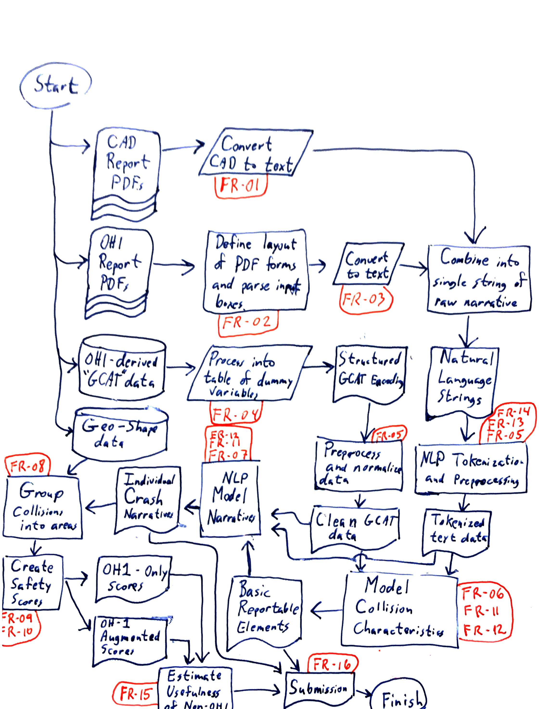

# AI System Design and Functional/Non-Functional Requirements

The proposed system must address the gap between actual and reported pedestrian/bicycle versus automobile collisions in the City of Cleveland. Under-reporting of these collisions represents a potential, or material, misallocation of resources for Pedestrian Safety Improvement Plans (PSIP), and this system must focus on characterizing that misallocation. This section details the design and requirements of this system.

# Functional Requirements (FR)

| Req ID   | Description   | Priority   | Category   | Verification Method   |
|----------|---------------|------------|------------|-----------------------|
| FR-01    | Ingest police Computer Aided Dispatch (CAD) reports in PDFs form and convert to text using common Python OCR libraries (pdf2image, pytesseract) | High  | Data Ingestion | Manual Review  |
| FR-02    | Define layout and creating bounding boxes of OH1 crash reports and be able to extract specific entry boxes | High  | Data Ingestion | Manual Review  |
| FR-03    | Ingest OH1 crash reports from the State of Ohio in PDF form and convert officer narratives to text using common Python OCR libraries (pdf2image, pytesseract) | High  | Data Ingestion | Manual Review  |
| FR-04    | Clean and process OH1-derived “GCAT” data provided in structured format from state of Ohio | High  | Data Preprocessing | Manual Review  |
| FR-05    | Tokenize and preprocess unstructured text to capture meaning of common police acronyms and remove stop words so that semantics are present and data is ML-readable |   | Data Preprocessing |   |
| FR-06a   | Use a predictive model to categorize driver vehicle type into the groups: Unknown, Passenger Car, Large Passenger Vehicle, Very Large Vehicle, Motorcycle or Micro-Mobility Device | Medium  | AI Modeling | Precision/Recall Measurement  |
| FR-06b   | Use a predictive model to Categorize driver maneuvers prior to collision: Unknown, Straight, Left turn, Right turn, Backward, Vehicle as weapon | Medium  | AI Modeling | Precision/Recall Measurement  |
| FR-06c   | Use a predictive model to Categorize pedestrian type: Unknown, Adult, Child, Multiple people | Medium  | AI Modeling | Precision/Recall Measurement  |
| FR-06d   | Use a predictive model to Categorize pedestrian mode of travel: Unknown, On foot, Bicycle, Micro-mobility device, Wheelchair or stroller | Medium  | AI Modeling | Precision/Recall Measurement  |
| FR-06e   | Use a predictive model to Categorize area of collision: Unknown, Intersection, Mid-block, Bike lane, Driveway | Medium  | AI Modeling | Precision/Recall Measurement  |
| FR-07    | Summarize individual collisions into a text narrative using NLP libraries (Transformers, nltk, PyTorch) | High  | AI Modeling | Human Review  |
| FR-08    | Group collisions together based on their association to sections and intersections or road | High  | Data Processing | Manual Review  |
| FR-09    | Create safety scores of every intersection along major arterial roads with ability to toggle between OH1-only and OH1-augmented data | High  | Data Processing | SME Consult  |
| FR-10    | Create pedestrian safety rankings of intersections along major arterial roads and demonstrate if inclusion of non-OH1 sourced data produces different conclusion from OH1-only data | High  | Data Processing | Statistical Evaluation  |
| FR-11    | Use GPU or parallel-CPU processing to train AI models | Medium  | AI Modeling | Manual Review  |
| FR-12    | Serialize AI models with the pickle Python module and embed in AWS-based web application and allow for updating of model without retraining | Low  | AI Modeling | Manual Review  |
| FR-13    | Convert police dispatch acronyms into natural language | Medium  | Preprocessing | Unit Testing  |
| FR-14    | Detect and remove all names from extracted text | Medium  | Preprocessing | Manual Review  |
| FR-15    | Quantify and compare usefulness of non-OH1 data | High  | Presentation | Manual Review  |
| FR-16    | Conclude results and present detail in updatable dashboard | High  | Presentation | Manual Review  |

# Non-Functional Requirements (NFR)

| Req ID   | Description   | Priority   | Category   | Verification Method   |
|----------|---------------|------------|------------|-----------------------|
| NFR-01   | Scale to handle CAD and OH1 reports for at least 5,000 collisions | Medium  | Scalability | Scalability Testing  |
| NFR-02   | Process batches of about 20 newly received reports in less than 3 minutes | Medium  | Performance | Performance Testing  |
| NFR-03   | Serialized model updates in near real-time | Medium  | Portability | Performance Testing  |
| NFR-04   | Produce runtime logs for importing new data and model update runs | High  | Reliability | Log Monitoring  |
| NFR-05   | Constructed in a modular design to facilitate updates and upgrades | Medium  | Maintainability | Code Review  |
| NFR-06a  | Code is readable and is PEP 8 compliant. All code must be processed by black v24.8 or later before merging into main branch | Medium  | Maintainability | Black Opinionated Formatter  |
| NFR-06b  | Code is readable and is PEP 8 compliant. All code must pass Flake8 v7.1.1 or later before merging into main branch | Medium  | Maintainability | Flake8 Linting Tool  |
| NFR-07   | Code must be stored and changes tracked in a Git repository | High  | Version Control / Maintainability | Code Review  |

# Ethics and Safety Requirements (ESR)

| Req ID   | Description   | Verification Method   |
|----------|---------------|-----------------------|
| ESR-01   | Must avoid introducing bias in safety rankings and prevent skew based on demographic or socio-economic conditions | Bias Audit  |
| ESR-02   | Must preserve privacy and not publicize personally identifiable information beyond what is already publicly available | PII Audit  |
| ESR-03   | Must have transparency in development of narratives and safety rankings | Manual Review  |
| ESR-04   | All code contributions must be traceable and critical changes that impact a system requirement must undergo an additional layer of approval. | Code Review  |

# Future Considerations / Out of Scope Requirement (OOS)

| Req ID   | Description   | Exclusion Reason   | Priority   | Dependency   |
|----------|---------------|--------------------|------------|--------------|
| OOS-FR-01 | Ingest dispatch data from other police departments in Cuyahoga county | Dispatch reports are different for each department and streamlined integration is expected to be effort intensive in addition to requiring extensive public records requests and/or collaboration with police officials | Must Have | Must prove concept with Cleveland before attempting this technique on other cities |
| OOS-FR-02 | Provide deployment capability with “pip install” to enable easy install by users | Current focus is development and proof of concept of AI modeling | Nice to have | None |
| OOS-FR-03 | Ingest novel non-CAD and non-OH1 into pipeline and model | Unknown what could be a viable alternative data source and access to alternative data is likely difficult | Nice to have | Must establish utility of CAD data before looking into non-CAD for OH1 augmentation  |
